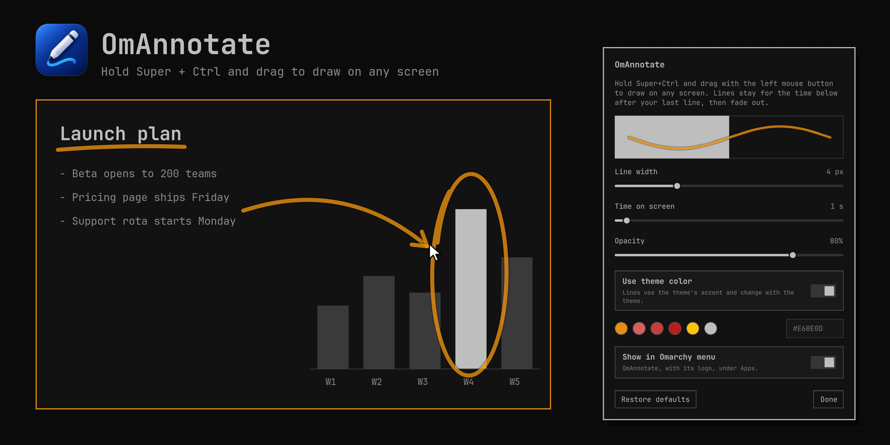
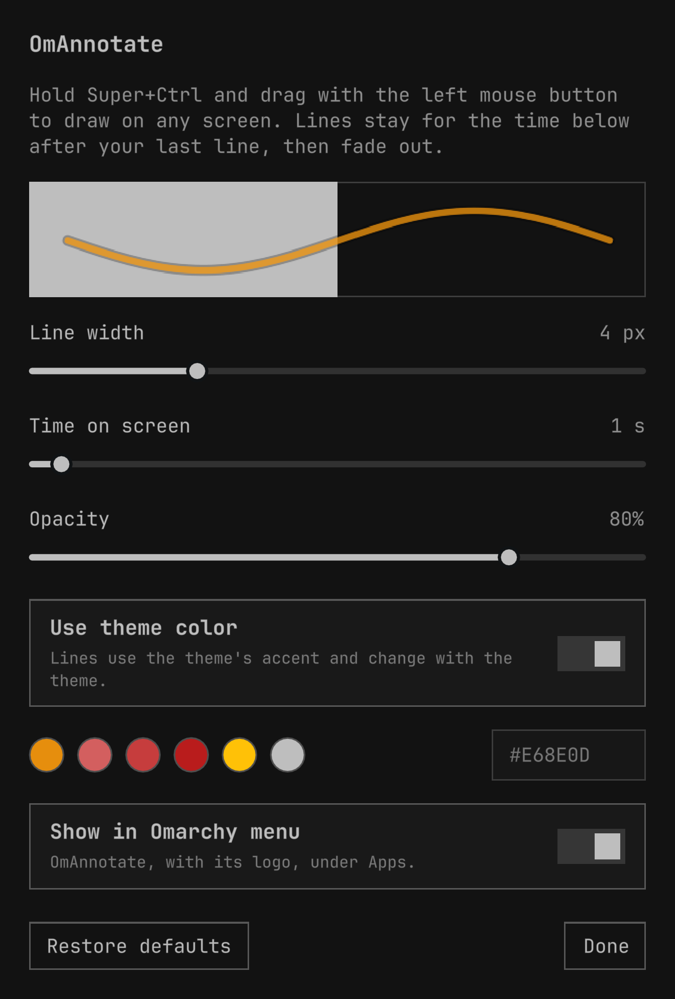

# OmAnnotate



Draw on your screen in Omarchy. Hold **Super+Ctrl** and drag with the left
mouse button: a line follows the cursor on any monitor, stays for a moment
after your last line, then fades away. Lines drawn close together fade
together, so an arrow's parts vanish at once.

Useful whenever someone is watching your screen: a Zoom, Google Meet or Teams
screen share, or a screen recording. The lines are part of the screen, so a
whole-screen share or recording shows them with no extra setup. (Sharing a
single window or browser tab does not include them.)

## Install

```bash
omarchy plugin add https://github.com/Z0H0wizard/omannotate --enable
```

That is all: OmAnnotate registers its own Super+Ctrl+drag shortcut with
Hyprland and shows up with its logo under **Apps** in the Omarchy menu (see
[App launcher](#app-launcher)). It never edits your Hyprland or menu
configuration, and nothing else is installed or downloaded.

Tested with Omarchy 4.0.4, Hyprland 0.56.2 (Lua configuration), Quickshell
0.3.1 and Qt 6.11.2. Other versions are untested; it relies on Omarchy's shell
plugin API and Hyprland's Lua `hyprctl eval`, `hl.bind` and `hl.timer`.

## Settings

Open **OmAnnotate** under Apps in the Omarchy menu (or search for it), or run
`omarchy-shell omannotate settings`. The settings open as a normal floating
window, so Super+W (like Esc or Done) closes it. It is drawn in your theme, and
its color swatches are your theme's own palette.



| Setting | Default | Range |
|---|---|---|
| Line width | 4 px | 1 to 12 px |
| Time on screen | 1.5 s after your last line | 0.5 to 10 s |
| Opacity | 80% | 10 to 100% |
| Use theme color | On | On or off |
| Color | #FF3B5C (used when "Use theme color" is off) | any #RRGGBB |
| Show in Omarchy menu | On | On or off |

- By default lines use your theme's accent color and change with the theme.
  Choosing a swatch or typing a color turns "Use theme color" off, so later
  theme changes keep your color; clicking into the color field and leaving it
  without typing changes nothing. Turn the switch back on to follow the theme.
- Width, color and opacity apply at once, including lines already on screen.
  Time on screen applies to lines finished after the change.
- Settings are stored in this plugin's entry in `~/.config/omarchy/shell.json`,
  for example
  `{ "id": "omannotate", "width": 4, "hold": 1.5, "opacity": 80, "useThemeColor": true, "color": "#FF3B5C" }`.
  Omarchy deletes that entry when the plugin is disabled, so disabling and
  enabling again starts from the defaults.

## App launcher

Omarchy's menu has no manifest field for plugin menu items and plugins have no
install step, so OmAnnotate adds its launcher itself when it starts.
**OmAnnotate under Apps**, with its logo, is two links into the plugin folder:
`~/.local/share/applications/omannotate.desktop` → `share/omannotate.desktop`
and `~/.local/share/icons/hicolor/512x512/apps/omannotate.png` → `icon.png`.
They follow `XDG_DATA_HOME` when it is set. When the plugin is disabled or
removed, the links are deleted a few seconds later, so the launcher disappears
from Apps; enabling the plugin again recreates them. If that ever misses (say
the shell was killed), opening the leftover launcher enables and opens
OmAnnotate when it is still installed, or removes the launcher and says so when
it is not. Only links that point into an OmAnnotate plugin folder are ever
removed: a launcher or icon of your own at either place is left alone.

Turning off **Show in Omarchy menu** removes the links and keeps them off
across restarts.

## Commands

```bash
omarchy-shell omannotate settings          # open the settings
omarchy-shell omannotate status            # lines, settings and versions, as JSON
omarchy-shell omannotate clear             # remove every line now
omarchy-shell omannotate set width 6       # change a setting: width, hold, opacity,
                                           # color, useThemeColor or menu

omarchy plugin update omannotate           # then: omarchy restart shell
omarchy plugin disable omannotate
omarchy plugin enable omannotate
```

After an update, omarchy-shell can keep running the previous code until it
restarts; OmAnnotate sends a notification when that is the case. Its shortcut
updates immediately.

Logs: `journalctl --user -t omarchy-shell | grep omannotate`

## Resource use

- **Idle:** no separate process. OmAnnotate looks at each Hyprland event to see
  whether it is one of its own; nothing else runs between lines. In our
  measurement (two shell restarts each way, Omarchy 4.0.4), omarchy-shell used
  4–5 MB more private memory with OmAnnotate enabled.
- **While drawing:** Hyprland reads the cursor every 16 ms (about 60 times a
  second, not tied to the monitor's refresh rate) and reports it only when it
  moved. Lines are drawn on the GPU in transparent overlay layers that ignore
  clicks.
- **After the last line fades:** the overlay layers are removed and the fade
  timer stops.

## How it works

- `hypr/omannotate.lua` is loaded into Hyprland with `hyprctl eval` when the
  plugin starts and again after every config reload. It binds
  Super+Ctrl+left-click and sends `omannotate start|move|end` events on
  Hyprland's event socket; the final position is sampled when the button comes
  up. The click is consumed, so the app underneath never sees it. The file is
  versioned: after an update, the newer copy takes over the running binds
  instead of adding more.
- `Service.qml` receives those events, keeps the lines (`Ink.js`) and shows
  them in one click-through overlay layer per monitor. It also keeps the
  launcher links (`bin/omannotate-launcher`, `share/omannotate.desktop`;
  `Launcher.js` deletes links left pointing nowhere after a removal).
- `Settings.qml` is the settings window; `ColorEditGuard.qml` makes the color
  field commit only real edits.

The shortcut's binds are only ever enabled or disabled, never unbound: in
Hyprland 0.56, unbinding removes every bind on the same key, and touching a
removed bind from Lua crashes Hyprland.

## Remove

```bash
omarchy plugin remove omannotate
```

Super+Ctrl+click stops drawing as soon as the plugin is removed or disabled,
and its disabled binds are gone after the next Hyprland config reload. The Apps
launcher's two links are deleted a few seconds later (already when disabling),
so it disappears too. Nothing else is left behind.

## License

MIT, © 2026 Legendary Solutions. See [LICENSE](LICENSE).

OmAnnotate has no external dependencies: it runs on Omarchy's own shell
(Quickshell, LGPL-3.0) and Hyprland (BSD-3-Clause), and uses `jq`,
`notify-send` (libnotify) and coreutils, which Omarchy already includes. It
does not bundle or modify any of them.

## Development

```bash
python3 scripts/make-art.py  # rebuild preview.png (needs pycairo)
```

`icon.png` is the logo. `docs/settings.png` is the settings window's own
content, saved with `omarchy-shell omannotate-settings capture <file.png>`
while it is open; the rest of `preview.png` is drawn by `scripts/make-art.py`.
The three images are reduced to 256 colors to keep the download small; reduce a
new one the same way before committing it, for example with
`pngquant --force --ext .png 256 preview.png`. Publishing notes are in
[docs/STORE.md](docs/STORE.md).
